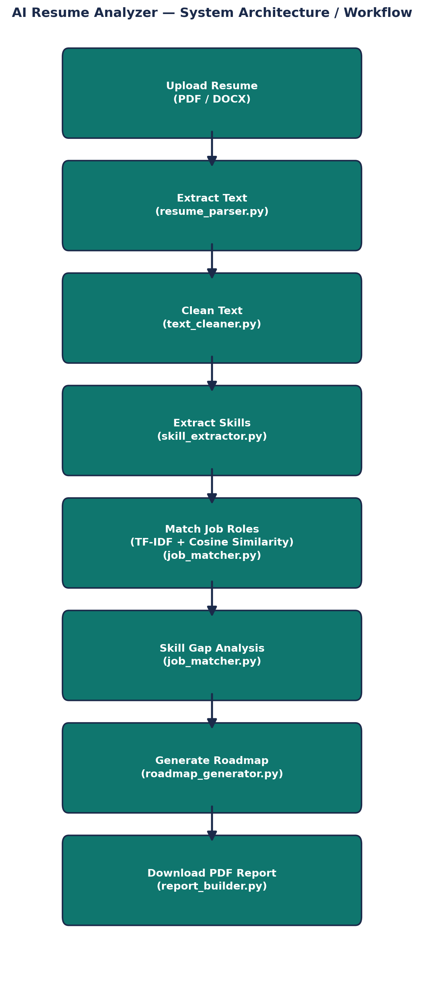

# AI Resume Analyzer & Job Recommendation System

An NLP-based Streamlit application that analyzes a resume, scores it against real job roles using TF-IDF and cosine similarity, identifies missing skills, and generates a personalized learning roadmap.

## System Architecture

## Project Overview

**Problem Statement:** Students and job seekers often don't know whether their resume matches the skills expected for a target role. This tool gives an instant, objective match score and a clear list of skill gaps to close.

**Objective:** Extract resume text, detect technical skills, compare against defined job-role requirements, recommend the best-fitting roles, and generate a learning roadmap for missing skills.

## Features
- Upload resumes in PDF or DOCX format
- Automatic text extraction and cleaning
- Skill detection via keyword matching against a categorized skill dictionary
- Job-role matching using TF-IDF vectorization + cosine similarity
- Top 3 recommended roles with match-score visualization
- Skill-gap analysis (present vs. missing skills) for any selected target role
- Auto-generated week-by-week learning roadmap for missing skills
- Downloadable PDF analysis report

## Tech Stack
- **Frontend/UI:** Streamlit
- **Text Extraction:** pypdf, python-docx
- **NLP/Matching:** scikit-learn (TF-IDF, cosine similarity)
- **Data Handling:** pandas, numpy
- **Report Generation:** reportlab

## Project Structure

ai_resume_analyzer/
├── app.py # Main Streamlit application
├── resume_parser.py # PDF/DOCX text extraction
├── text_cleaner.py # Text normalization/cleaning
├── skill_extractor.py # Skill detection via keyword matching
├── job_matcher.py # TF-IDF matching + skill-gap analysis
├── roadmap_generator.py # Learning roadmap generation
├── report_builder.py # PDF report generation
├── requirements.txt
├── data/
│ ├── job_roles.csv
│ └── skill_dictionary.csv
└── README.md

## Setup Instructions

1. Clone the repository:

git clone <your-repo-url>
cd ai_resume_analyzer

2. Create and activate a virtual environment:

python -m venv venv
venv\Scripts\activate

3. Install dependencies:

pip install -r requirements.txt

4. Run the application:

streamlit run app.py

5. Open the app in your browser (usually at `http://localhost:8501`)

## Usage Instructions
1. Upload a resume (PDF or DOCX) using the sidebar uploader
2. View extracted skills, grouped by category
3. Review the job-role match scores chart and top 3 recommended roles
4. Select a target role from the dropdown for a detailed skill-gap breakdown
5. Review the suggested learning roadmap for any missing skills
6. Click "Download Report as PDF" to save a full analysis summary

## Matching Approach (Beginner Level)
- Keyword matching against a manually curated skill dictionary for skill extraction
- TF-IDF vectorization to convert detected skills and each job role's required skills into comparable numeric vectors
- Cosine similarity to calculate a match score (0-100%) between the resume and each role

## Responsible AI Notes
- Match scores are estimates meant to guide learning, not a substitute for recruiter judgment
- The system does not evaluate personal attributes (age, gender, photo, etc.) — only job-related skills
- Uploaded resumes are processed in-memory for the session only and are not written to disk

## Known Limitations
- Keyword matching can miss skills phrased differently (e.g., "ML" vs. "machine learning")
- The job-role dataset is a small, manually curated set (5 roles)

## Future Improvements
- Use spaCy or Sentence Transformers for semantic matching
- Expand the job-role and skill dictionaries
- Add resume section detection (education, experience, projects)